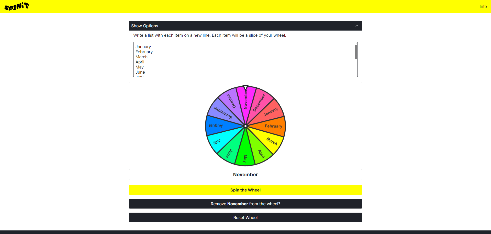

# SPINiT

Create a spinning wheel and let your decision be driven by it.

## What is it?

A tool that lets you insert text and spin a wheel to decide a random result. Create a spinning wheel and let your decision be driven by it.

## How to use it?

1. Write a list of text (e.g. names, activities, chores), and make sure each item is on a new line.

2. Click the `Spin the Wheel` button and the wheel will decide for you.
